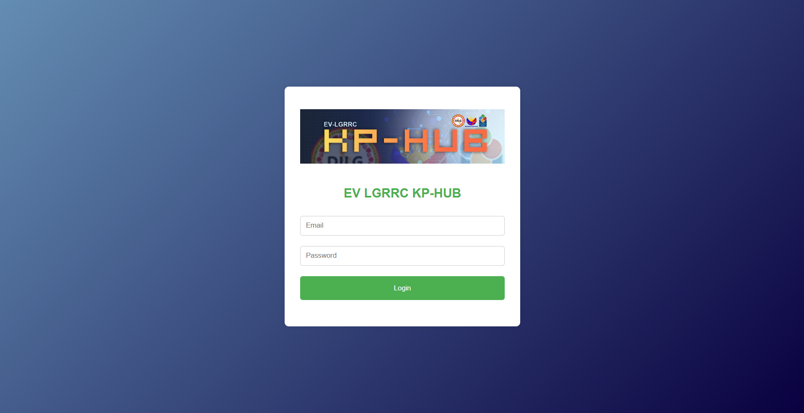
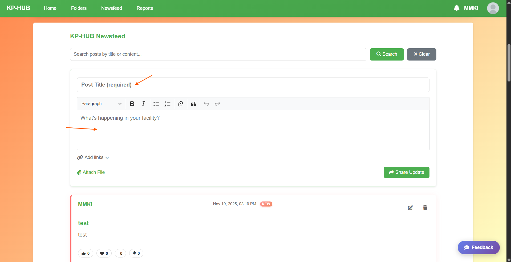
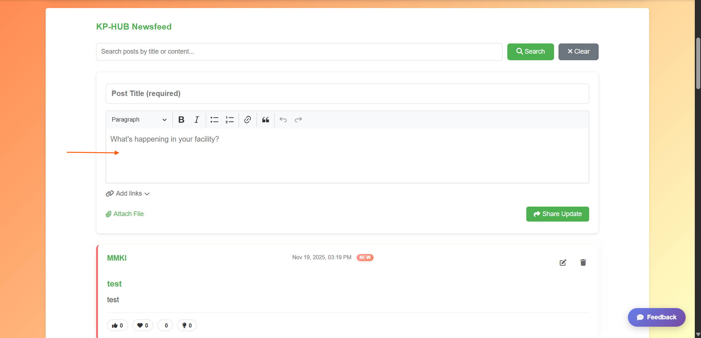
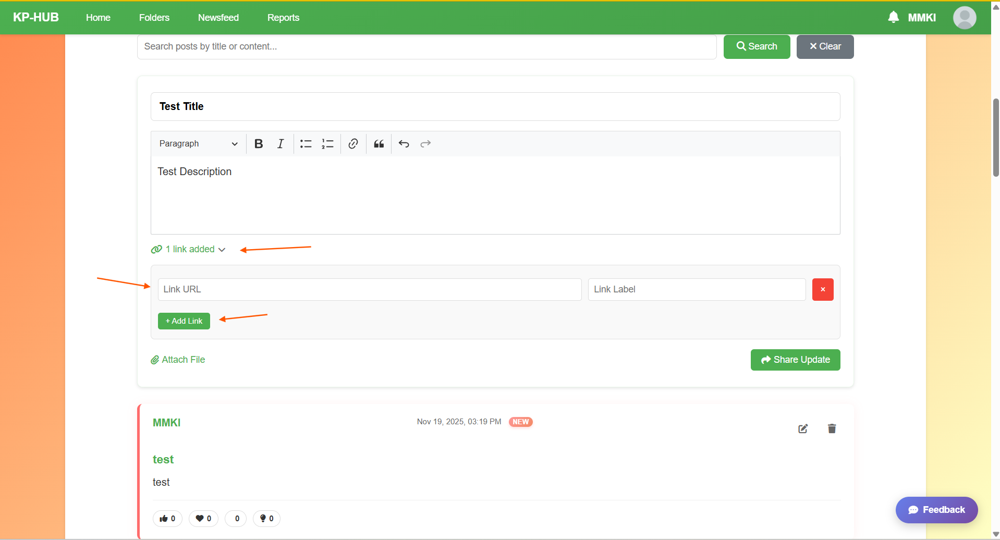
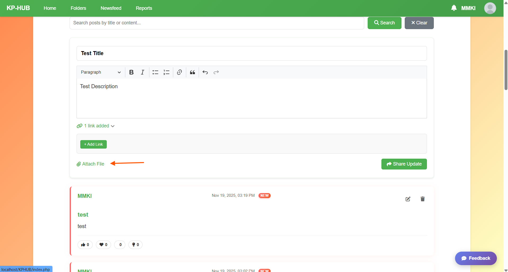
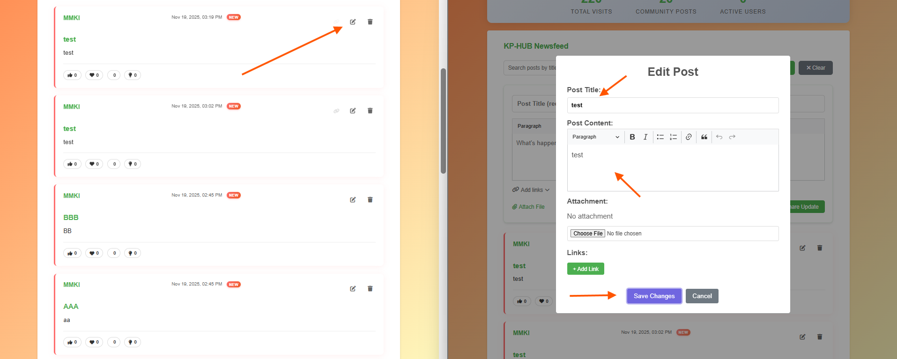
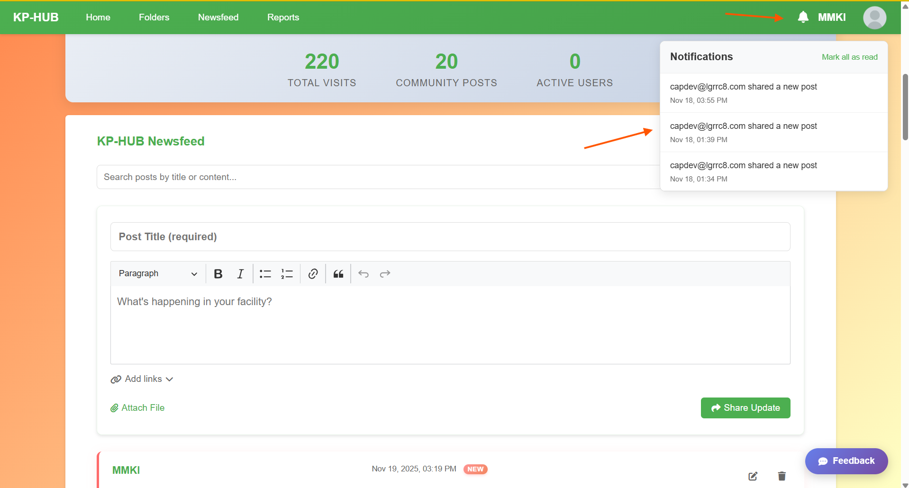

# Knowledge Product Hub — User Guide

**Version:** 1.1.0 (2025-11-20)

This guide is for regular users of Knowledge Product Hub (posting, reacting, files, profile management).

Contents
- Quick Start
- Logging In
- Creating a Post (step-by-step)
- Attaching Files
- Adding Links
- Editing / Deleting Posts
- Reactions
- Searching & Pagination
- Notifications
- Viewing & Uploading to Folders
- Sharing Files/Folders to Newsfeed
- Profile Management
- Troubleshooting (user-focused)

---

## Quick Start

1. Open the site in your browser (example: `https://kphub.dilgrictu8.com`).
2. Click 'Login' and Login with your credentials.
3. Go to the Newsfeed tab to view or create posts.

## Logging In

1. Open `https://kphub.dilgrictu8.com`.
2. Click "Login" at the top menu bar.
3. Enter your username and password.
4. Click "Login".

Screenshot placeholder:

Tip: If login fails, confirm with your admin that your account exists and is active.

## Creating a Post (step-by-step)

1. After logging in, navigate to the **Newsfeed** tab.
2. Click into the **Post Title** field and enter a concise title.

   Screenshot placeholder:
   

3. Write your content using the rich text editor (CKEditor). Use toolbar buttons to format text, add links, lists, or headings.

   Screenshot placeholder:
   

4. (Optional) Add links using the "Add links" toggle:
   - Click the "Add links" button.
   - Click "+ Add Link" to add a row.
   - Fill `Label` and `URL` for each link.

   Screenshot placeholder:
   

5. (Optional) Attach a file: click the paperclip icon and choose a file from your device.

6. Click **Share Update** to publish the post.

Expected result: The post appears at the top of the newsfeed (you may need to refresh or will be moved to page 1).

## Attaching Files

- Click the paperclip / Attach File label in the post form.
- Choose a file from your device. Files are stored locally on the server for better performance and reliability.
- Max file limits and allowed types depend on server config. If uploads fail, check file size and try again.

Screenshot placeholder:

## Adding Links

- Click the small link icon/toggle in the creation form, then add labeled URL entries.
- Links will appear under a "Links" section in your published post.

## Editing / Deleting Posts

- For posts you own, the top-right of the post shows Edit (pencil) and Delete (trash) icons.
- Click Edit to open the editor with the post content. Update fields and save.
- Click Delete to remove the post — a confirmation appears before final deletion.

Screenshot placeholder:

## Reactions

- Posts have reaction buttons such as Like, Love, Celebrate, Insightful.
- Click a reaction to toggle it. Counts update immediately.

## Searching & Pagination

- Use the search box above the newsfeed to search by title or content.
- Pagination controls appear at the bottom when more posts exist; use Next / Previous to move through pages.

## Notifications

- Click the bell icon to open notifications.
- Unread notifications show a numeric badge. Click an item to mark it read.

Screenshot placeholder:

## Viewing & Uploading to Folders

- Go to **Folders** (for logged-in users).
- Click a folder to view contents.
- Click "Upload Here" to upload files to the current folder.
- Folder uploads use Google Drive storage and are proxied via the configured Apps Script.

Screenshot placeholder:

## Sharing Files/Folders to Newsfeed

- Use the share icon on a file or folder card to post it to the newsfeed with an optional message.
- The system will create a post with the file/folder link and your message.

## Recent Features & Improvements

### Version 1.1.0 Updates
- **Enhanced Profile Management**: Streamlined profile picture upload with integrated hover interface
- **Dynamic Header Updates**: Profile picture changes are immediately reflected in the header menu bar across all pages
- **Local File Storage**: Post attachments now save to local server storage instead of Google Drive for improved performance
- **Improved Security**: Enhanced password strength validation and secure file upload handling
- **Better User Experience**: Subtle animations, improved error messages, and responsive design
- **File Upload Logging**: All profile picture uploads are now logged for better tracking and security

### Key Features
- **Real-time Profile Updates**: Changes to your profile picture appear instantly throughout the application
- **Secure File Handling**: All uploads are validated for type, size, and security before processing
- **Session Management**: Improved user session handling for better security and reliability

### Changelog (v1.1.0)
- ✅ **Profile Picture Integration**: Converted upload interface to subtle hover-based system
- ✅ **Dynamic Header Updates**: Profile pictures now update in real-time across all pages
- ✅ **Local File Storage**: Post attachments now save locally instead of Google Drive
- ✅ **Enhanced Security**: Added file upload logging and improved validation
- ✅ **UI Improvements**: Better animations, error handling, and responsive design
- ✅ **Database Fixes**: Resolved schema inconsistencies and session management issues

## Troubleshooting (user-focused)

- **"Post creation failed"**: Check that title and content are filled. Large file uploads may cause timeouts.
- **"File upload failed"**: Verify file size (max 5MB) and allowed types (JPG, PNG, GIF, WebP); try again or contact admin.
- **"Profile picture not updating"**: Try refreshing the page. If the issue persists, check your internet connection and try uploading again.
- **"Login session expired"**: Log out and log back in. Your session may have timed out for security reasons.
- **"Password strength requirements"**: Ensure your new password meets the strength criteria shown during profile updates.
- If the newsfeed is empty, try refreshing the page or checking with an admin whether posts are restricted.

---

**Application Status**: Knowledge Product Hub is a fully functional knowledge sharing platform with enhanced profile management, secure file uploads, and real-time UI updates. All core features are operational and tested.

If you'd like, I can: 
- fill the `screenshots/` folder with updated sample images, 
- produce a printable PDF, or
- add step-by-step guidance with exact click coordinates for a chosen browser.

Tell me what to expand next.